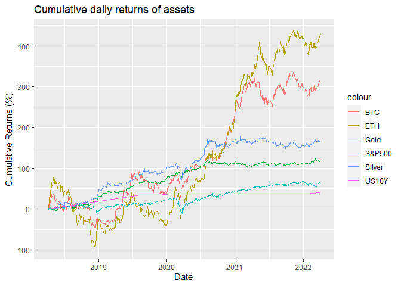
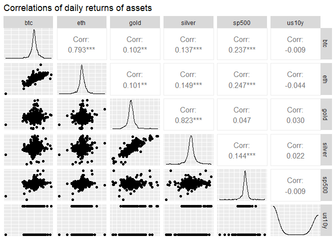
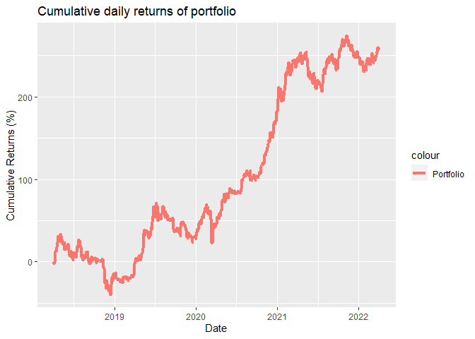
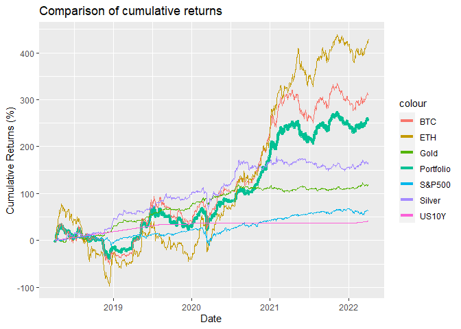
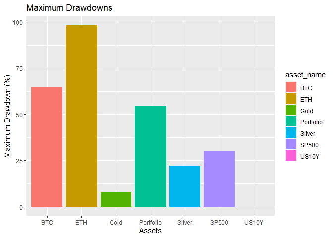

Making of an Investment Portfolio : A Case Study
================
Atakan Devrent
2022-04-08

# Introduction

In our global and extremely interconnected society, investing for many
individuals is more accessible than ever. However with this
accessibility comes great responsibility as well: making proper
investment decisions about our personal finance needs some research and
hard work.

### Goals of the case study

By conducting this case study we aim to achieve the following
objectives:

-   Analyze the correlations between 6 different assets in 4 different
    groups.

-   Calculate total and daily returns of our assets. For the sake of
    consistency and simplicity, date range will be restricted to **04
    April 2018** to **04 April 2022**.

-   Construct an ideal investment portfolio consisting of our assets
    with different weightings. Monthly returns of our portfolio should
    outperform benchmarks of our choice (like our assets *US 10 Year
    Treasuries* or *S&P500 index*) and have an acceptable *drawdown*
    (*Drawdown* means how much the portfolio’s current value is at any
    given time versus its all-time high.)

-   Calculate metrics such as *Sharpe Ratio, Maximum Drawdown, Return on
    Equity* (RoE) (RoE is synanymous with return on portfolio)

-   Compare our portfolio metrics to other benchmarks.

### Choosing the datasets

We are going to be looking at datasets of 6 assets from “Yahoo Finance”
and “investing.com”:
**[Bitcoin](https://finance.yahoo.com/quote/BTC-USD/history/),
[Ethereum](https://finance.yahoo.com/quote/ETH-USD/history/), [S&P 500
Index](https://www.investing.com/indices/us-spx-500-historical-data/),
[US 10 Year Treasury
Yield](https://finance.yahoo.com/quote/%5ETNX/history),
[Gold](https://www.investing.com/commodities/gold-historical-data),
[Silver](https://finance.yahoo.com/quote/SI%3DF).**

##### Notes about datasets :

-   We are going to use the **date** (as *Date*), **closing price of
    day** (as *Close*) as our values.
-   About “US 10 Year Treasury Yield” we won’t be using a closing price.
    Instead, we are going to convert its yield to daily return. Because
    the compounding effect of this conversion will be minimal, we will
    disregard this effect for the sake of simplicity.

# Cleaning and Organizing the Data

We start by installing and loading our packages:

``` r
library("tidyverse")
library("lubridate")
library("scales")
library("GGally")
library("PerformanceAnalytics")
library("xts")
library("knitr")
library("rmarkdown")
```

Then we load our *csv* datasets to our environment:

``` r
btc_daily <- read_csv("btcusd_daily.csv")
```

    ## Rows: 2761 Columns: 7
    ## -- Column specification --------------------------------------------------------
    ## Delimiter: ","
    ## dbl  (6): Open, High, Low, Close, Adj Close, Volume
    ## date (1): Date
    ## 
    ## i Use `spec()` to retrieve the full column specification for this data.
    ## i Specify the column types or set `show_col_types = FALSE` to quiet this message.

``` r
eth_daily <- read_csv("ethusd_daily.csv")
```

    ## Rows: 1612 Columns: 7
    ## -- Column specification --------------------------------------------------------
    ## Delimiter: ","
    ## dbl  (6): Open, High, Low, Close, Adj Close, Volume
    ## date (1): Date
    ## 
    ## i Use `spec()` to retrieve the full column specification for this data.
    ## i Specify the column types or set `show_col_types = FALSE` to quiet this message.

``` r
sp500_daily <- read_csv("sp500_daily.csv")
```

    ## Rows: 1011 Columns: 7
    ## -- Column specification --------------------------------------------------------
    ## Delimiter: ","
    ## chr (3): Date, Vol., Change %
    ## 
    ## i Use `spec()` to retrieve the full column specification for this data.
    ## i Specify the column types or set `show_col_types = FALSE` to quiet this message.

``` r
us10y_yields_daily <- read_csv("us10y_yields_daily.csv")
```

    ## Rows: 18732 Columns: 7
    ## -- Column specification --------------------------------------------------------
    ## Delimiter: ","
    ## chr  (6): Open, High, Low, Close, Adj Close, Volume
    ## date (1): Date
    ## 
    ## i Use `spec()` to retrieve the full column specification for this data.
    ## i Specify the column types or set `show_col_types = FALSE` to quiet this message.

``` r
gold_daily <- read_csv("gold_daily.csv")
```

    ## Rows: 1081 Columns: 7
    ## -- Column specification --------------------------------------------------------
    ## Delimiter: ","
    ## chr (3): Date, Vol., Change %
    ## 
    ## i Use `spec()` to retrieve the full column specification for this data.
    ## i Specify the column types or set `show_col_types = FALSE` to quiet this message.

``` r
silver_daily <- read_csv("silver_daily.csv")
```

    ## Rows: 1276 Columns: 7
    ## -- Column specification --------------------------------------------------------
    ## Delimiter: ","
    ## chr (3): Date, Vol., Change %
    ## dbl (4): Price, Open, High, Low
    ## 
    ## i Use `spec()` to retrieve the full column specification for this data.
    ## i Specify the column types or set `show_col_types = FALSE` to quiet this message.

After checking out our datasets, we notice the data loaded from
“investing.com” has different date formats. Correct format should be
**YYYY-MM-DD**, as in other datasets. We can fix this with *lubridate*
package.

``` r
gold_daily$Date <- mdy(gold_daily$Date)
silver_daily$Date <- mdy(silver_daily$Date)
sp500_daily$Date <- mdy(sp500_daily$Date)
```

And because traditional financial markets are closed on weekends, we
should also remove weekends from all datasets to create consistency.
Then we *filter* all datasets to date ranges between **2018-04-04** to
**2022-04-04**. After that, we sort all datasets by *Date* in ascending
order:

``` r
btc_daily_clean <- btc_daily %>% 
  filter(wday(Date) != 1, wday(Date) != 7) %>% 
  filter(Date >= "2018-04-04", Date <= "2022-04-04") %>% 
  arrange(Date)

eth_daily_clean <- eth_daily %>% 
  filter(wday(Date) != 1, wday(Date) != 7) %>% 
  filter(Date >= "2018-04-04", Date <= "2022-04-04") %>% 
  arrange(Date)


gold_daily_clean <- gold_daily %>% 
  filter(wday(Date) != 1, wday(Date) != 7) %>% 
  filter(Date >= "2018-04-04", Date <= "2022-04-04") %>% 
  arrange(Date)

silver_daily_clean <- silver_daily %>% 
  filter(wday(Date) != 1, wday(Date) != 7) %>% 
  filter(Date >= "2018-04-04", Date <= "2022-04-04") %>% 
  arrange(Date)

sp500_daily_clean <- sp500_daily %>% 
  filter(wday(Date) != 1, wday(Date) != 7) %>% 
  filter(Date >= "2018-04-04", Date <= "2022-04-04") %>% 
  arrange(Date)

us10y_yields_daily_clean <- us10y_yields_daily %>% 
  filter(wday(Date) != 1, wday(Date) != 7) %>% 
  filter(Date >= "2018-04-04", Date <= "2022-04-04") %>% 
  arrange(Date)
```

As you can see, our dating formats are now consistent across all
datasets:

``` r
head(btc_daily_clean)
```

    ## # A tibble: 6 x 7
    ##   Date        Open  High   Low Close `Adj Close`     Volume
    ##   <date>     <dbl> <dbl> <dbl> <dbl>       <dbl>      <dbl>
    ## 1 2018-04-04 7456. 7470. 6804. 6854.       6854. 4936000000
    ## 2 2018-04-05 6849. 6934. 6645. 6811.       6811. 5639320064
    ## 3 2018-04-06 6816. 6857. 6575  6636.       6636. 3766810112
    ## 4 2018-04-09 7044. 7178. 6662. 6771.       6771. 4894060032
    ## 5 2018-04-10 6795. 6872. 6704. 6835.       6835. 4272750080
    ## 6 2018-04-11 6843. 6968. 6818. 6968.       6968. 4641889792

``` r
head(gold_daily_clean)
```

    ## # A tibble: 6 x 7
    ##   Date       Price  Open  High   Low Vol.  `Change %`
    ##   <date>     <dbl> <dbl> <dbl> <dbl> <chr> <chr>     
    ## 1 2018-04-04 1440. 1440. 1440. 1440. 0.72K 0.22%     
    ## 2 2018-04-05 1428. 1428. 1428. 1428. 0.26K -0.81%    
    ## 3 2018-04-06 1436. 1436. 1436. 1436. 0.35K 0.55%     
    ## 4 2018-04-09 1440. 1440. 1440. 1440. 0.29K 0.26%     
    ## 5 2018-04-10 1446. 1446. 1446. 1446. 0.11K 0.41%     
    ## 6 2018-04-11 1460  1460  1460  1460  0.00K 1.00%

``` r
head(us10y_yields_daily_clean)
```

    ## # A tibble: 6 x 7
    ##   Date       Open     High     Low      Close    `Adj Close` Volume
    ##   <date>     <chr>    <chr>    <chr>    <chr>    <chr>       <chr> 
    ## 1 2018-04-04 2.757000 2.795000 2.748000 2.788000 2.788000    0     
    ## 2 2018-04-05 2.817000 2.834000 2.814000 2.832000 2.832000    0     
    ## 3 2018-04-06 2.819000 2.819000 2.774000 2.775000 2.775000    0     
    ## 4 2018-04-09 2.790000 2.812000 2.786000 2.786000 2.786000    0     
    ## 5 2018-04-10 2.799000 2.812000 2.784000 2.797000 2.797000    0     
    ## 6 2018-04-11 2.777000 2.797000 2.755000 2.790000 2.790000    0

We also need to rename our columns to later join our dataframes:

``` r
btc_daily_clean <- rename(btc_daily_clean, Close = Close)
eth_daily_clean <- rename(eth_daily_clean, Close = Close)
gold_daily_clean <- rename(gold_daily_clean, Close = Price)
silver_daily_clean <- rename(silver_daily_clean, Close = Price)
sp500_daily_clean <- rename(sp500_daily_clean, Close = Price)
us10y_yields_daily_clean <- rename(us10y_yields_daily_clean, Close = Close)
```

As we said we only need the columns *Date* and *Close*. We are going to
calculate *daily_return* and *daily_return_perc* (daily return as
percentage) ourselves. Also in *us10y_yields_daily_clean* dataset
datatype of *Close* column seems chr, we should convert that into *num*
datatype:

``` r
btc_daily_clean <- btc_daily_clean %>% 
  select(Date, Close) %>% 
  mutate(daily_return = Close - lag(Close)) %>% 
  mutate(daily_return_perc = daily_return / lag(Close)) %>% 
  mutate(Asset = "btc")

  
eth_daily_clean <- eth_daily_clean %>% 
  select(Date, Close) %>% 
  mutate(daily_return = Close - lag(Close)) %>% 
  mutate(daily_return_perc = daily_return / lag(Close)) %>% 
  mutate(Asset = "eth")

gold_daily_clean <- gold_daily_clean %>% 
  select(Date, Close) %>% 
  mutate(daily_return = Close - lag(Close)) %>% 
  mutate(daily_return_perc = daily_return / lag(Close)) %>% 
  mutate(Asset = "gold")

silver_daily_clean <- silver_daily_clean %>% 
  select(Date, Close) %>% 
  mutate(daily_return = Close - lag(Close)) %>% 
  mutate(daily_return_perc = daily_return / lag(Close)) %>% 
  mutate(Asset = "silver")

sp500_daily_clean <- sp500_daily_clean %>% 
  select(Date, Close) %>% 
  mutate(daily_return = Close - lag(Close)) %>% 
  mutate(daily_return_perc = daily_return / lag(Close)) %>% 
  mutate(Asset = "sp500")

us10y_yields_daily_clean$Close <- as.numeric(us10y_yields_daily_clean$Close)
```

    ## Warning: NAs introduced by coercion

``` r
us10y_yields_daily_clean <- us10y_yields_daily_clean %>% 
  select(Date, Close) %>% 
  mutate(daily_return = Close / (365 * 10)) %>% 
  mutate(daily_return_perc = daily_return) %>% 
  mutate(Asset = "us10y_yields")

btc_daily_clean$daily_return_perc <- round(btc_daily_clean$daily_return_perc, digits = 3)
eth_daily_clean$daily_return_perc <- round(eth_daily_clean$daily_return_perc, digits = 3)
gold_daily_clean$daily_return_perc <- round(gold_daily_clean$daily_return_perc, digits = 3)
silver_daily_clean$daily_return_perc <- round(silver_daily_clean$daily_return_perc, digits = 3)
sp500_daily_clean$daily_return_perc <- round(sp500_daily_clean$daily_return_perc, digits = 3)
us10y_yields_daily_clean$daily_return_perc <- round(us10y_yields_daily_clean$daily_return_perc, digits = 3)
```

Next we merge our asset data frames into a single data frame named
*assets_data*. After that we extract **daily return percentages** into a
new dataset called *daily_returns_perc_data*. Note that we again trimmed
the dates to exclude national holidays when traditional markets were
closed.

``` r
assets_list <- list(btc_daily_clean, eth_daily_clean, gold_daily_clean, silver_daily_clean, sp500_daily_clean, us10y_yields_daily_clean)

assets_data <- assets_list %>% 
  reduce(full_join, by = c("Date", "Close", "daily_return", "daily_return_perc", "Asset"))

daily_return_perc_btc <- assets_data %>%
  arrange(Date) %>% 
  filter(Asset == "btc") %>% 
  select(Date, daily_return_perc)

daily_return_perc_eth <- assets_data %>% 
  arrange(Date) %>% 
  filter(Asset == "eth") %>% 
  select(Date, daily_return_perc)

daily_return_perc_gold <- assets_data %>% 
  arrange(Date) %>% 
  filter(Asset == "gold") %>% 
  select(Date, daily_return_perc)

daily_return_perc_silver <- assets_data %>% 
  arrange(Date) %>% 
  filter(Asset == "silver") %>% 
  select(Date, daily_return_perc)

daily_return_perc_sp500 <- assets_data %>% 
  arrange(Date) %>% 
  filter(Asset == "sp500") %>% 
  select(Date, daily_return_perc)

daily_return_perc_us10y_yields <- assets_data %>% 
  arrange(Date) %>% 
  filter(Asset == "us10y_yields") %>% 
  select(Date, daily_return_perc)

daily_returns_perc_list <- list(daily_return_perc_btc, daily_return_perc_eth, daily_return_perc_gold, daily_return_perc_silver, daily_return_perc_sp500, daily_return_perc_us10y_yields)

daily_returns_perc_data <- daily_returns_perc_list %>% 
  reduce(inner_join, by = "Date")

daily_returns_perc_data <- daily_returns_perc_data %>% 
  rename(btc = daily_return_perc.x) %>% 
  rename(eth = daily_return_perc.y) %>% 
  rename(gold = daily_return_perc.x.x) %>% 
  rename(silver = daily_return_perc.y.y) %>% 
  rename(sp500 = daily_return_perc.x.x.x) %>% 
  rename(us10y = daily_return_perc.y.y.y)
```

Removing first raw because daily returns and daily return percentages
are *NA*:

``` r
daily_returns_perc_data <- na.omit(daily_returns_perc_data)
```

Finally, our datasets are now clean and organized:

``` r
head(assets_data)
```

    ## # A tibble: 6 x 5
    ##   Date       Close daily_return daily_return_perc Asset
    ##   <date>     <dbl>        <dbl>             <dbl> <chr>
    ## 1 2018-04-04 6854.         NA              NA     btc  
    ## 2 2018-04-05 6811.        -42.4            -0.006 btc  
    ## 3 2018-04-06 6636.       -175.             -0.026 btc  
    ## 4 2018-04-09 6771.        134.              0.02  btc  
    ## 5 2018-04-10 6835.         64.0             0.009 btc  
    ## 6 2018-04-11 6968.        134.              0.02  btc

``` r
head(daily_returns_perc_data)
```

    ## # A tibble: 6 x 7
    ##   Date          btc    eth   gold silver  sp500 us10y
    ##   <date>      <dbl>  <dbl>  <dbl>  <dbl>  <dbl> <dbl>
    ## 1 2018-04-05 -0.006  0.007 -0.008  0.005  0.007 0.001
    ## 2 2018-04-06 -0.026 -0.034  0.005  0     -0.022 0.001
    ## 3 2018-04-09  0.02   0.076  0.003  0.008  0.003 0.001
    ## 4 2018-04-10  0.009  0.039  0.004  0.003  0.017 0.001
    ## 5 2018-04-11  0.02   0.039  0.01   0.009 -0.006 0.001
    ## 6 2018-04-12  0.132  0.145 -0.013 -0.016  0.008 0.001

# Data Analysis

### Cumulative daily returns

Here we are going to visualize **cumulative daily returns** of our
assets from **2018-04-05** to **2022-04-04**. We discover that digital
assets (*BTC* and *ETH*) are the top performers in our time frame, while
US *10 Year Treasury Yield* is the worst performer:

``` r
ggplot(data = daily_returns_perc_data) +
  geom_line(mapping = aes(x = Date, y = 100 * cumsum(btc), color = "BTC")) +
  geom_line(mapping = aes(x = Date, y = 100 * cumsum(eth), color = "ETH")) +
  geom_line(mapping = aes(x = Date, y = 100 * cumsum(gold), color = "Gold")) +
  geom_line(mapping = aes(x = Date, y = 100 * cumsum(silver), color = "Silver")) +
  geom_line(mapping = aes(x = Date, y = 100 * cumsum(sp500), color = "S&P500")) +
  geom_line(mapping = aes(x = Date, y = 100 * cumsum(us10y), color = "US10Y")) +
  labs(title = "Cumulative daily returns of assets") +
  ylab("Cumulative Returns (%)")
```

<!-- -->

Then we look at our selected assets’ correlations of daily returns:

### Asset Correlations

``` r
ggpairs(daily_returns_perc_data, columns = 2:7, title = "Correlations of daily returns of assets", axisLabels="none")
```

<!-- -->

Let’s compare our correlation coefficients by observing the values from
[scribbr.com](https://www.scribbr.com/statistics/correlation-coefficient/).
Please note that we are going to assume *Moderate* and *Weak*
correlations as uncorrelated:


According to our table we discover the following:

-   Correlation between **Bitcoin** and **Ethereum** is *Very Strong*.
-   Correlation between **Gold** and **Silver** is *Very Strong*.
-   Rest of the pairs are *uncorrelated*.

With our new insights, we can group our assets into 4 categories
considering their *correlations*:

-   **Digital assets** : Bitcoin and Ethereum
-   **Commodities** : Gold and Silver
-   **Indexes** : S&P500 Index
-   **Bonds** : US 10 Year Treasury Yields

# Constructing our Portfolio

For the sake of simplicity, we are going to split our portfolio equally
into 4 uncorrelated groups of assets while also splitting them equally
inside the groups as well:

-   25% of our portfolio is going to be buy-and-hold **Digital Assets**
    (12,5% BTC and 12,5% ETH)
-   25% of our portfolio is going to be buy-and-hold **Commodities**
    (12,5% Gold and 12,5% Silver)
-   25% of our portfolio is going to be buy-and-hold **Indexes** (25%
    S&P500 Index)
-   25% of our portfolio is going to be buy-and-hold **Bonds** (25% US
    10 Year Treasury Yields)

Then let’s create a data frame for our portfolio:

``` r
portfolio_date <- select(daily_returns_perc_data, "Date")

btc_perc <- daily_returns_perc_data %>% 
  select(btc) / 8

eth_perc <- daily_returns_perc_data %>% 
  select(eth) / 8

gold_perc <- daily_returns_perc_data %>% 
  select(btc) / 8

silver_perc <- daily_returns_perc_data %>% 
  select(btc) / 8

sp500_perc <- daily_returns_perc_data %>% 
  select(btc) / 4

us10y_perc <- daily_returns_perc_data %>% 
  select(us10y) / 4


portfolio_daily_return_perc <- (btc_perc + eth_perc + gold_perc + silver_perc + sp500_perc + us10y_perc)

portfolio_data <- data.frame(portfolio_date, portfolio_daily_return_perc)

portfolio_data <- portfolio_data %>% 
  rename(daily_return_perc = btc)

portfolio_data$daily_return_perc <- round(portfolio_data$daily_return_perc, digits = 4)

head(portfolio_data)
```

    ##         Date daily_return_perc
    ## 1 2018-04-05           -0.0026
    ## 2 2018-04-06           -0.0202
    ## 3 2018-04-09            0.0223
    ## 4 2018-04-10            0.0108
    ## 5 2018-04-11            0.0176
    ## 6 2018-04-12            0.1009

Cumulative returns of our portfolio:

``` r
ggplot(data = portfolio_data) +
  geom_line(size = 1.5, mapping = aes(x = Date, y = 100 * cumsum(daily_return_perc), color = "Portfolio")) +
  labs(title = "Cumulative daily returns of portfolio") +
  ylab("Cumulative Returns (%)")
```

<!-- -->

# Comparing our portfolio to benchmarks

Comparing portfolio returns with other assets :

``` r
ggplot(data = NULL) +
  geom_line(data = portfolio_data, size = 1.5, mapping = aes(x = Date, y = 100 * cumsum(daily_return_perc), color = "Portfolio")) +
  geom_line(data = daily_returns_perc_data, mapping = aes(x = Date, y = 100 * cumsum(btc), color = "BTC")) +
  geom_line(data = daily_returns_perc_data, mapping = aes(x = Date, y = 100 * cumsum(eth), color = "ETH")) +
  geom_line(data = daily_returns_perc_data, mapping = aes(x = Date, y = 100 * cumsum(gold), color = "Gold")) +
  geom_line(data = daily_returns_perc_data, mapping = aes(x = Date, y = 100 * cumsum(silver), color = "Silver")) +
  geom_line(data = daily_returns_perc_data, mapping = aes(x = Date, y = 100 * cumsum(sp500), color = "S&P500")) +
  geom_line(data = daily_returns_perc_data, mapping = aes(x = Date, y = 100 * cumsum(us10y), color = "US10Y")) +
  labs(title = "Comparison of cumulative returns") +
  ylab("Cumulative Returns (%)")
```

<!-- -->

### Calculating sharpe ratios of our portfolio and the assets

First we should convert our data format to time series (“xts”):

``` r
daily_returns_perc_data_xts <- xts(daily_returns_perc_data[ , colnames(daily_returns_perc_data) != "Date"], daily_returns_perc_data$Date)
portfolio_data_xts <- xts(portfolio_data$daily_return_perc, portfolio_data$Date)
```

Maximum drawdowns :

``` r
portfolio_max_drawdown <- maxDrawdown(portfolio_data_xts, geometric = FALSE)
assets_max_drawdown <- maxDrawdown(daily_returns_perc_data_xts, geometric = FALSE)

max_drawdown_ratios <- c(portfolio_max_drawdown, assets_max_drawdown)

asset_name <- c("Portfolio", "BTC", "ETH", "Gold", "Silver", "SP500", "US10Y")

drawdown_data <- data.frame(asset_name, max_drawdown_ratios)

drawdown_data_percent <- drawdown_data %>% 
  mutate(max_drawdown_percent = percent(max_drawdown_ratios))

tibble(drawdown_data_percent)
```

    ## # A tibble: 7 x 3
    ##   asset_name max_drawdown_ratios max_drawdown_percent
    ##   <chr>                    <dbl> <chr>               
    ## 1 Portfolio               0.548  54.8%               
    ## 2 BTC                     0.644  64.4%               
    ## 3 ETH                     0.983  98.3%               
    ## 4 Gold                    0.0756 7.6%                
    ## 5 Silver                  0.218  21.8%               
    ## 6 SP500                   0.302  30.2%               
    ## 7 US10Y                   0      0.0%

Then we calculate the annualized sharpe ratios:

``` r
portfolio_sharpe <- SharpeRatio(portfolio_data_xts, Rf = 0.02 / 365, FUN = "StdDev", annualize = TRUE)
assets_sharpe <- SharpeRatio(daily_returns_perc_data_xts, Rf = 0.02 / 365, FUN = "StdDev", annualize = TRUE)

sharpe_ratio <- c(portfolio_sharpe, assets_sharpe)

sharpe_data <- data.frame(asset_name, sharpe_ratio)

tibble(sharpe_data)
```

    ## # A tibble: 7 x 2
    ##   asset_name sharpe_ratio
    ##   <chr>             <dbl>
    ## 1 Portfolio         1.18 
    ## 2 BTC               0.968
    ## 3 ETH               0.915
    ## 4 Gold              1.68 
    ## 5 Silver            1.20 
    ## 6 SP500             0.618
    ## 7 US10Y            11.9

``` r
sharpe_data_without_us10y <- sharpe_data %>% 
  filter(asset_name != "US10Y")
```

Please note that the unusually high *Sharpe Ratio* of **US 10 Year
Treasury Yield** is due to its zero drawdown. For the sake of simplicity
of this study, we will delve no further on bond pricing.

# Conclusions and Final Remarks

### Returns and Risk comparison of our portfolio to other assets

According to our analysis, cumulative returns of our portfolio
**outperformed** all but *digital assets*:

``` r
ggplot(data = NULL) +
  geom_line(data = portfolio_data, size = 1.5, mapping = aes(x = Date, y = 100 * cumsum(daily_return_perc), color = "Portfolio")) +
  geom_line(data = daily_returns_perc_data, mapping = aes(x = Date, y = 100 * cumsum(btc), color = "BTC")) +
  geom_line(data = daily_returns_perc_data, mapping = aes(x = Date, y = 100 * cumsum(eth), color = "ETH")) +
  geom_line(data = daily_returns_perc_data, mapping = aes(x = Date, y = 100 * cumsum(gold), color = "Gold")) +
  geom_line(data = daily_returns_perc_data, mapping = aes(x = Date, y = 100 * cumsum(silver), color = "Silver")) +
  geom_line(data = daily_returns_perc_data, mapping = aes(x = Date, y = 100 * cumsum(sp500), color = "S&P500")) +
  geom_line(data = daily_returns_perc_data, mapping = aes(x = Date, y = 100 * cumsum(us10y), color = "US10Y")) +
  labs(title = "Comparison of cumulative returns") +
  ylab("Cumulative Returns (%)")
```

<!-- -->

But while sacrificing some returns, our portfolio has reduced risk
compared to digital assets by reduced exposure to Bitcoin and Ethereum:

``` r
ggplot(data = drawdown_data) + geom_col(mapping = aes(x = asset_name, y = max_drawdown_ratios * 100, fill = asset_name)) +
  labs(title = "Maximum Drawdowns") +
  xlab("Assets") +
  ylab("Maximum Drawdown (%)")
```

<!-- -->

Finally, *Sharpe Ratio* of our portfolio is nearly the same as *Silver*,
while maintaining gigantic returns compared to traditional markets. Note
that we did not include *US 10 Year Treasury Yield* in this chart to
exclude visualization bias.

``` r
ggplot(data = sharpe_data_without_us10y) + geom_col(mapping = aes(x = asset_name, y = sharpe_ratio, fill = asset_name)) +
  labs(title = "Annualized Sharpe Ratios") +
  xlab("Assets") +
  ylab("Annualized Sharpe Ratio")
```

<!-- -->

### Conclusions

According to the analysis we have made, our constructed demo portfolio
is in most ways a better investment than going all-in in any of the
assets we have inspected for this project, although it might be said
drawdown is not acceptable. For the sake of simplicity, we did not delve
into in-depth topics such as slippage, indexing, leverage, margin,
liquidity or bond pricing but we believe this project has achieved its
pre-determined goals.

### Final remarks

I have created this case study as a Capstone Project for Google Data
Analytics Certificate. Please note that there are some minor
inaccuracies considering numbers (for example ETH’s drawdown should be
\~90% not 98%) which in my opinion comes from some rounding errors while
we were organizing & cleaning the data. While I do not have the
knowledge and experience to bugfix those (yet), I believe they are not
major problems in a first project so I have decided to publish the
project as it is.

In this case study I have tried to refrain from using Google Sheets or
SQL in cleaning & organizing data to push myself more in R and it
certainly helped me hone my R skills immensely! For final remarks, I
believe although portfolio optimization is a hugely complex topic, one
can always start from the basics and make his/her way through the
magnificent world of financial data science. You can always contact me
at my [Twitter](https://twitter.com/a_devrent).
